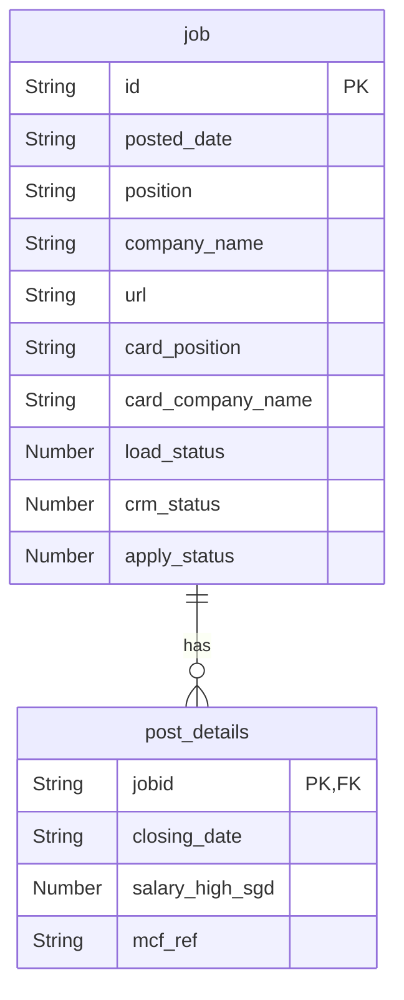
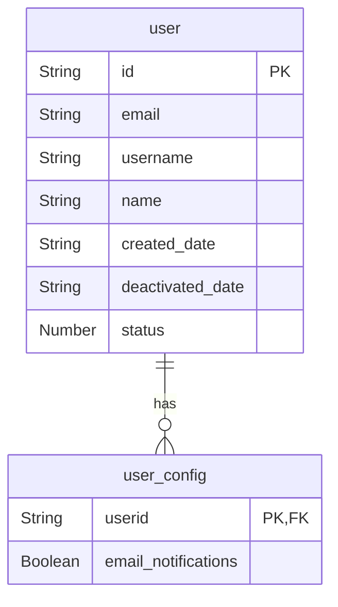
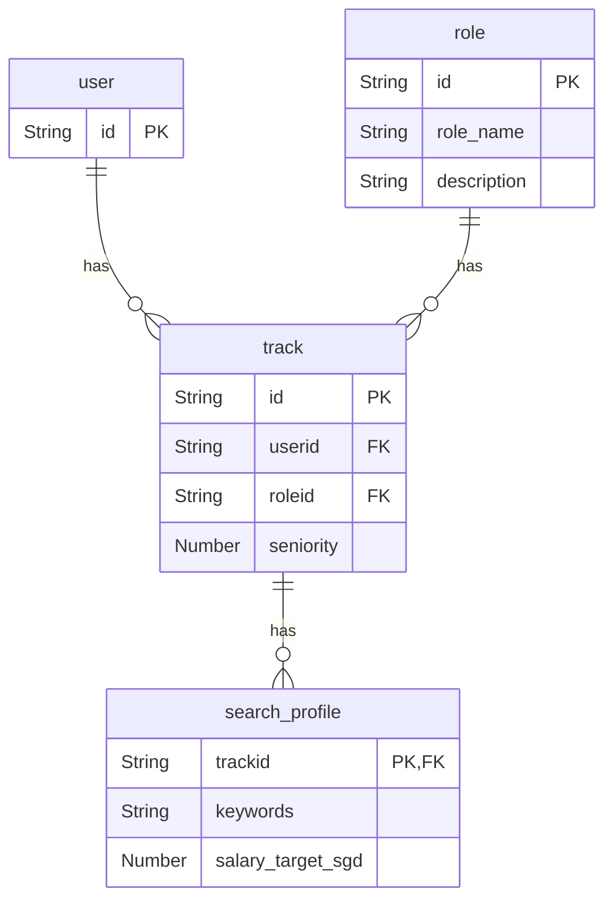

# Data model
data model with list of tables and schema information

__Groups__

| id | group | description |
| - | - | - |
| 01 | user | users and settings |
| 02 | search | role, role-specific tracks and search profile |
| 03 | job | job information with workflow status and details scraped from posts and user-updated |

__Tables__

| id | group | table | description |
| - | - | - | - |
| 01 | jobs | job | list of registered jobs, includes url and workflow status codes |
| 02 | jobs | post_details | job details either scraped from post or manually updated |
| 03 | user | user | list of users |
| 04 | user | user_config | user profile and customization settings |
| 05 | search | role | generic job roles ex Data Engineer, Data Scientist |
| 06 | search | track | strategic tracks user-role pairs with additional specification for seniority |
| 07 | search | search_profile | search configuration by track: keywords, target salary |

## Jobs
data tables to describe job information scraped from job post

__ERD__

### Table: job

- Primary Key: `id`  
- Sort Key: `posted_date`

| Column Name       | Data Type | Nullable | Description                             |
|-------------------|-----------|----------|-----------------------------------------|
| id                | String    | No       | Unique job identifier                   |
| posted_date       | String    | No       | Date the job was posted                 |
| position          | String    | No       | Job title                               |
| company_name      | String    | Yes      | Full company name                       |
| url               | String    | Yes      | URL to the job post                     |
| card_position     | String    | Yes      | Position title from card preview        |
| card_company_name | String    | Yes      | Company name from card preview          |
| load_status       | Number    | No       | Ingestion stage (e.g., 0=CARD, 1=POST)  |
| crm_status        | Number    | Yes      | CRM funnel stage (e.g., SHORTLIST, etc.)|
| apply_status      | Number    | Yes      | Application outcome (e.g., TOAPPLY)     |

### Table: post_details

- Primary Key: `jobid`
- Sort Key: `closing_date`

| Column Name      | Data Type | Nullable | Description                    |
|------------------|-----------|----------|--------------------------------|
| jobid            | String    | No       | Foreign key to job table       |
| closing_date     | String    | No       | Application deadline date      |
| salary_high_sgd  | Number    | Yes      | Maximum salary in SGD          |
| mcf_ref          | String    | Yes      | MCF reference code             |

## Users
user-related configuration tables

__ERD__

### Table: user

- Primary Key: `id`

| Column Name       | Data Type | Nullable | Description                     |
|-------------------|-----------|----------|---------------------------------|
| id                | String    | No       | Unique user identifier          |
| email             | String    | No       | Email address                   |
| username          | String    | No       | Username                        |
| name              | String    | Yes      | Full name                       |
| created_date      | String    | No       | Account creation date           |
| deactivated_date  | String    | Yes      | Account deactivation date       |
| status            | Number    | No       | User status (e.g., 1=active)    |

### Table: user_config

- Primary Key: `userid`

| Column Name          | Data Type | Nullable | Description                              |
|----------------------|-----------|----------|------------------------------------------|
| userid               | String    | No       | Foreign key to user                      |
| email_notifications  | Boolean   | Yes      | Whether user receives email notifications|

## Search
tables related to search configuration

__ERD__

### Table: role

- Primary Key: `id`

| Column Name  | Data Type | Nullable | Description         |
|--------------|-----------|----------|---------------------|
| id           | String    | No       | Role identifier     |
| role_name    | String    | No       | Name of the role    |
| description  | String    | Yes      | Description of role |

### Table: track

- Primary Key: `id`
- Sort Key: `userid`

| Column Name | Data Type | Nullable | Description                  |
|-------------|-----------|----------|------------------------------|
| id          | String    | No       | Track identifier             |
| userid      | String    | No       | Foreign key to user          |
| roleid      | String    | No       | Foreign key to role          |
| seniority   | Number    | Yes      | Level of seniority (e.g., 1) |

### Table: search_profile

- Primary Key: `trackid`

| Column Name         | Data Type | Nullable | Description                        |
|---------------------|-----------|----------|------------------------------------|
| trackid             | String    | No       | profile ID and foreign key to track|
| keywords            | String    | Yes      | Keywords for job search            |
| salary_target_sgd   | Number    | Yes      | Target salary in SGD               |
