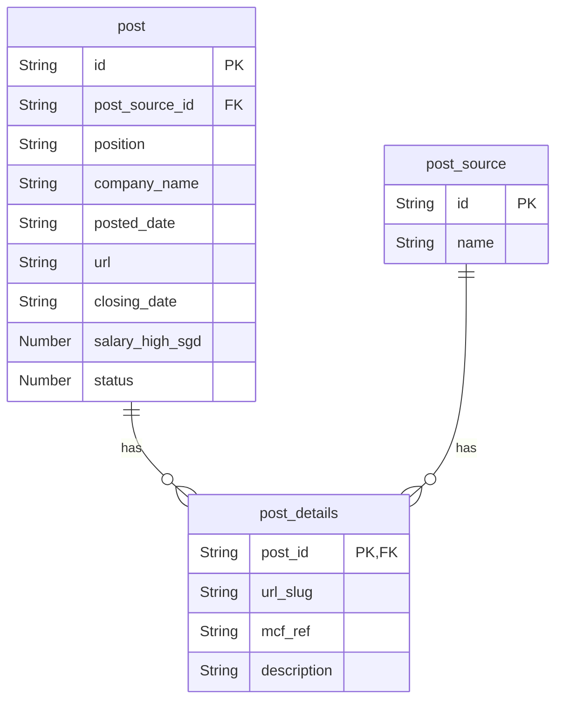
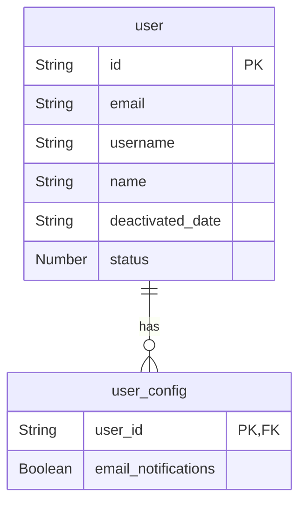
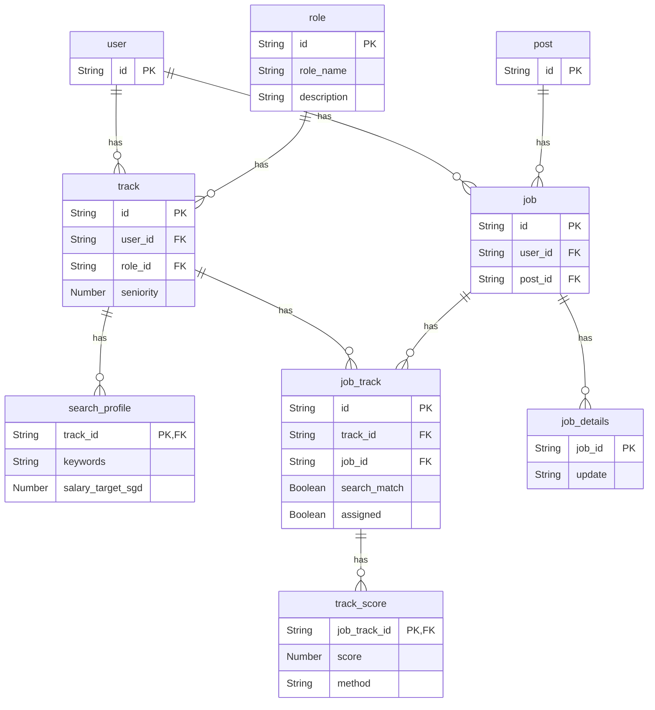
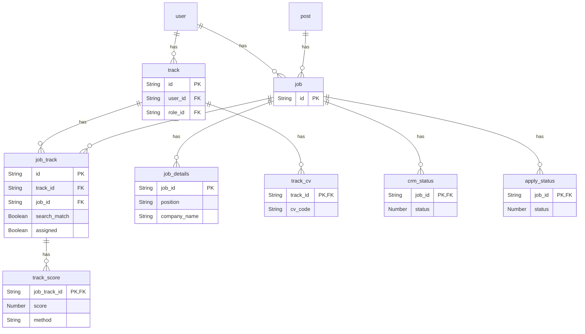

# Data model
data model with list of tables and schema information

__Groups__

| id | group | description |
| - | - | - |
| 01 | user | users and settings |
| 02 | search | role, role-specific tracks and search profile |
| 03 | post | job post information with workflow status and details scraped from posts and user-updated |
| 04 | crm | user specific job application lead conversion model from search results, application, to offer |

__Tables__

| id | group | table | description |
| - | - | - | - |
| 01 | post | post | list of registered posts, includes url and workflow status codes |
| 02 | post | post_details | post details either scraped from post or manually updated |
| 03 | user | user | list of users |
| 04 | user | user_config | user profile and customization settings |
| 05 | search | role | generic job roles ex Data Engineer, Data Scientist |
| 06 | search | track | strategic tracks user-role pairs with additional specification for seniority |
| 07 | search | search_profile | search configuration by track: keywords, target salary |
| 08 | search | job_track | job search results for a user search profile, includes track assignment |
| 09 | search | job | derived table from job_track unique list of jobs for single user |
| 10 | search | track_score | match assessment score for a given job-track pair |
| 12 | crm | track_cv | assignment of a user cv to a track |
| 13 | crm | crm_status | job status in the conversion pipeline OPEN, CLOSED, EXPIRED, TOAPPLY, APPLIED, INTERVIEW, etc.. |
| 14 | crm | apply_status | job status in the application workflow OPEN, SUCCESS, FAILED |

## Global patterns

- **Primary key** Primary key column name `id` in the origin table and `<table_name>_id` elsewhere. 

    - **Data type** Primary key data type String
    - **origin single PK** for origin, single PK table - auto-incremented Integer
    - **assignment combo PK** use hash for combo PK `<table_A>_<id_A>_<table_B>_<id_B>` example `post_0002_user_1001` for `post_id`: `0002` and `user_id`: `1001`
    - **ULID** auto assign with semi timestamp based ULID based unique identifer. 

- **Date formats** limit to two cannonical date formats
    - `ISO_TIMESTAMP`: YYYY-MM-DD HH:MM:SS
    - `ISO_DATE`: YYYY-MM-DD
- **SCD columns** all tables include `created` and `last_modified` timestamp, excluded from this documentation, with `ISO_TIMESTAMP` format for forward compatibility with SCD update logic

__ULID implementation__

- 128-bit: first 48 bits = milliseconds. 
- Lexicographic sort == chronological (ms). 
- Many libs support monotonic ULIDs, if you generate multiple in the same ms, the random tail is incremented so sort order stays strictly increasing within one process.
- 26 chars, Crockford Base32, uppercase alphabet without ambiguous chars (no I, L, O, U). 
- Regex: ^[0-9A-HJKMNP-TV-Z]{26}$. Case-insensitive by spec, but store as uppercase to preserve lexical ordering semantics everywhere.
- multiple mature libs (ulid-py, python-ulid, ulid-transform) and good cross-language parity (Go, JS/TS, Rust, etc.). Monotonic ULID support is common.

## Posts
data tables to describe job post information scraped from the web source ex: MyCareerFutures website or manually entered

__ERD__

```mermaid
erDiagram
    post {
        String id PK
        String post_source_id FK
        String position
        String company_name
        String posted_date
        String url
        String closing_date
        Number salary_high_sgd
        Number status
    }

    post_details {
        String post_id PK, FK
        String url_slug
        String mcf_ref
        String description
    }

    post_source {
        String id PK
        String name
    }

    post ||--o{ post_details : has
    post_source ||--o{ post_details : has
```

### Table: post

- Primary Key: `id`  
- Sort Key: `posted_date`

| Column Name       | Data Type | Nullable | Description                             |
|-------------------|-----------|----------|-----------------------------------------|
| id                | String    | No       | Unique post identifier                  |
| post_source_id   | String    | No       | Foreign key to post_source table |
| position          | String    | No       | Job title                               |
| company_name      | String    | Yes      | Full company name                       |
| posted_date       | String    | No       | Date the job was posted                 |
| url               | String    | Yes      | URL to the job post                     |
| closing_date     | String    | Yes       | Application deadline date      |
| salary_high_sgd  | Number    | Yes      | Maximum salary in SGD          |
| status            | Number    | No       | Ingestion stage (e.g., 0=CARD, 1=POST, 2=CLOSED)  |

__Global Secondary Indexes__

| id | Partition key | Sort key | Projection | Purpose  |
| -- | -------- | --- | ------------ | -------------------- |
| 01 | status | posted_date DESC | ALL | Latest posts by status, newest first |

### Table: post_details

- Primary Key: `post_id`

| Column Name      | Data Type | Nullable | Description                    |
|------------------|-----------|----------|--------------------------------|
| post_id           | String    | No       | Foreign key to post table     |
| description      | String    | Yes      | long text description about the job and requirements |
| url_slug         | String    | Yes      | primary MCF UID reference from url |
| mcf_ref          | String    | Yes      | secondary MCF reference taken from card and or post |

__Global Secondary Indexes__

| id | Partition key | Sort key | Projection | Purpose  |
| -- | -------- | --- | ------------ | -------------------- |
| 01 | url_slug | post_id | KEYS_ONLY | Search by `url_slug` for duplicate check   |

### Table: post_source

- Primary Key: `id`

| Column Name      | Data Type | Nullable | Description                    |
|------------------|-----------|----------|--------------------------------|
| id               | Number    | No       | Unique source identifier       |
| name             | String    | No       | ex: MyCareerFutures            |

## Users
user-related configuration tables

__ERD__

```mermaid
erDiagram
    user {
        String id PK
        String email
        String username
        String name
        String deactivated_date
        Number status
    }

    user_config {
        String user_id PK, FK
        Boolean email_notifications
    }

    user ||--o{ user_config : has
```

### Table: user

- Primary Key: `id`

| Column Name       | Data Type | Nullable | Description                     |
|-------------------|-----------|----------|---------------------------------|
| id                | String    | No       | Unique user identifier          |
| email             | String    | No       | Email address                   |
| username          | String    | No       | Username                        |
| name              | String    | Yes      | Full name                       |
| deactivated_date  | String    | Yes      | Account deactivation date       |
| status            | Number    | No       | User status (e.g., 1=active)    |

__Global Secondary Indexes__

| id | Partition key | Sort key | Projection | Purpose          |
| - |---------------|----------|------------|------------------|
| 01 | email        | —        | KEYS_ONLY  | Lookup by email  |
| 02 | username     | —        | KEYS_ONLY  | Lookup by username  |
| 03 | status       | —        | ALL  | Lookup by status  |

### Table: user_config

- Primary Key: `user_id`

| Column Name          | Data Type | Nullable | Description                              |
|----------------------|-----------|----------|------------------------------------------|
| user_id              | String    | No       | Foreign key to user                      |
| email_notifications  | Boolean   | Yes      | Whether user receives email notifications|

## Search
tables related to user-specific job search 

__ERD__

```mermaid
erDiagram
    post {
        String id PK
    }

    user {
        String id PK
    }

    role {
        String id PK
        String role_name
        String description
    }

    track {
        String id PK
        String user_id FK
        String role_id FK
        Number seniority
    }

    search_profile {
        String track_id PK, FK
        String keywords
        Number salary_target_sgd
    }

    job_track {
        String id PK
        String track_id FK
        String job_id FK
        Boolean search_match
        Boolean assigned
    }

    job {
        String id PK
        String user_id FK
        String post_id FK
    }

    job_details {
        String job_id PK
        String update
    }

    track_score {
        String job_track_id PK, FK
        Number score
        String method
    }

    user ||--o{ track : has
    role ||--o{ track : has
    user ||--o{ job : has
    post ||--o{ job : has
    track ||--o{ search_profile : has
    track ||--o{ job_track : has
    job ||--o{ job_track : has
    job_track ||--o{ track_score : has
    job ||--o{ job_details : has
```

### Table: role

- Primary Key: `id`

| Column Name  | Data Type | Nullable | Description         |
|--------------|-----------|----------|---------------------|
| id           | String    | No       | Role identifier     |
| role_name    | String    | No       | Name of the role    |
| description  | String    | Yes      | Description of role |

### Table: track

- Primary Key: `id`
- Sort Key: `user_id`

| Column Name | Data Type | Nullable | Description                  |
|-------------|-----------|----------|------------------------------|
| id          | String    | No       | UUID hash user-role          |
| user_id     | String    | No       | Foreign key to user          |
| role_id     | String    | No       | Foreign key to role          |
| seniority   | Number    | Yes      | Level of seniority (e.g., 1) |

__Global Secondary Indexes__

| id | Partition key | Sort key | Projection | Purpose          |
| - |---------------|----------|------------|------------------|
| 01 | user_id      | —        | ALL  | Filter tracks by user  |

### Table: search_profile

- Primary Key: `track_id`

| Column Name         | Data Type | Nullable | Description                        |
|---------------------|-----------|----------|------------------------------------|
| track_id            | String    | No       | profile ID and foreign key to track|
| keywords            | String    | Yes      | Keywords for job search            |
| salary_target_sgd   | Number    | Yes      | Target salary in SGD               |

### Table: job_track

- Primary Key: `id`
- Sort Key: `track_id`

| Column Name        | Data Type | Nullable | Description                    |
|--------------------|-----------|----------|--------------------------------|
| id                 | String    | No       | UUID hash job-track            |
| job_id             | String    | No       | Foreign key to job table       |
| track_id           | String    | No       | Foreign key to track table     |
| search_match       | Boolean   | Yes      | showed up in search results? [Y/N]  |
| assigned           | Boolean   | Yes      | job assigned to the track, only 1 track per job  |

__Global Secondary Indexes__

| id | Partition key | Sort key   | Projection | Purpose |
| - |-- | - | -| -|
| 01 | job_id  | track_id | ALL        | Tracks for a job |
| 02 | track_id  | job_id | ALL        | Jobs for a given track |

### Table: job

- Primary Key: `id`
- Sort Key: `user_id`

| Column Name        | Data Type | Nullable | Description                    |
|--------------------|-----------|----------|--------------------------------|
| id                 | String    | No       | UUID hash user-post            |
| user_id            | String    | No       | Foreign key to user table     |
| post_id            | String    | No       | Foreign key to post table     |
| post_source_id   | String    | No       | Foreign key to post_source table |
| position          | String    | No       | Job title                               |
| posted_date       | String    | No       | Date the job was posted                 |
| closing_date     | String    | No       | Application deadline date      |
| company_name      | String    | Yes      | Full company name                       |
| url               | String    | Yes      | URL to the job post                     |
| salary_high_sgd  | Number    | Yes      | Maximum salary in SGD          |

__Global Secondary Indexes__

| id | Partition key   | Sort key | Projection  | Purpose |
|----|----------|----------|----|-------|
| 01 | user_id  | id | INCLUDE [post_id, position, company_name, posted_date, url] | Per-user timeline & list (newest-first)   |
| 02 | post_id  | id | KEYS_ONLY  | Dedupe / fetch job by post |
| 04 | user_id  | company_name | KEYS_ONLY  | Filter a user’s jobs by company |
| 05 | user_id  | position | KEYS_ONLY  | Filter a user’s jobs by position |

### Table: job_details

- Primary Key: `job_id`

| Column Name      | Data Type | Nullable | Description                    |
|------------------|-----------|----------|--------------------------------|
| job_id           | String    | No       | Foreign key to job table      |
| update         | String    | Yes      |status update free text description field  |

### Table: track_score

- Primary Key: `job_track_id`

| Column Name      | Data Type | Nullable | Description                    |
|------------------|-----------|----------|--------------------------------|
| job_track_id     | String    | No       | Foreign key to job_track table |
| score            | Number    | No       | 0-1 numeric score of quality of job to track |
| method           | String    | No       | scoring method: keyword, BERT, etc.. |

## CRM
User specific job application lead conversion model from search results, application, to offer

__ERD__

```mermaid
erDiagram
    track {
        String id PK
        String user_id FK
        String role_id FK
    }

    job {
        String id PK
    }

    job_track {
        String id PK
        String track_id FK
        String job_id FK
        Boolean search_match
        Boolean assigned
    }

    job_details {
        String job_id PK
        String position
        String company_name
    }

    track_score {
        String job_track_id PK, FK
        Number score
        String method
    }

    track_cv {
        String track_id PK, FK
        String cv_code
    }

    crm_status {
        String job_id PK, FK
        Number status
    }

    apply_status {
        String job_id PK, FK
        Number status
    }

    user ||--o{ job : has
    post ||--o{ job : has
    user ||--o{ track : has
    track ||--o{ job_track : has
    job ||--o{ job_track : has
    job ||--o{ job_details : has
    job_track ||--o{ track_score : has
    track ||--o{ track_cv : has
    job ||--o{ crm_status : has
    job ||--o{ apply_status : has
```

### Table: track_cv

- Primary Key: `track_id`

| Column Name      | Data Type | Nullable | Description                    |
|------------------|-----------|----------|--------------------------------|
| track_id         | String    | No       | Foreign key to track table     |
| cv_code          | String    | No       | Reference to CV identifier in MCF user profile |

### Table: crm_status

- Primary Key: `job_id`

| Column Name      | Data Type | Nullable | Description                    |
|------------------|-----------|----------|--------------------------------|
| job_id           | String    | No       | Foreign key to job table       |
| status           | Number    | No       | job status in the conversion pipeline OPEN, CLOSED, EXPIRED, TOAPPLY, APPLIED, INTERVIEW, etc.. |

### Table: apply_status

- Primary Key: `job_id`

| Column Name      | Data Type | Nullable | Description                    |
|------------------|-----------|----------|--------------------------------|
| job_id           | String    | No       | Foreign key to job table       |
| status           | Number    | No       | job status in the application workflow OPEN, SUCCESS, FAILED |
