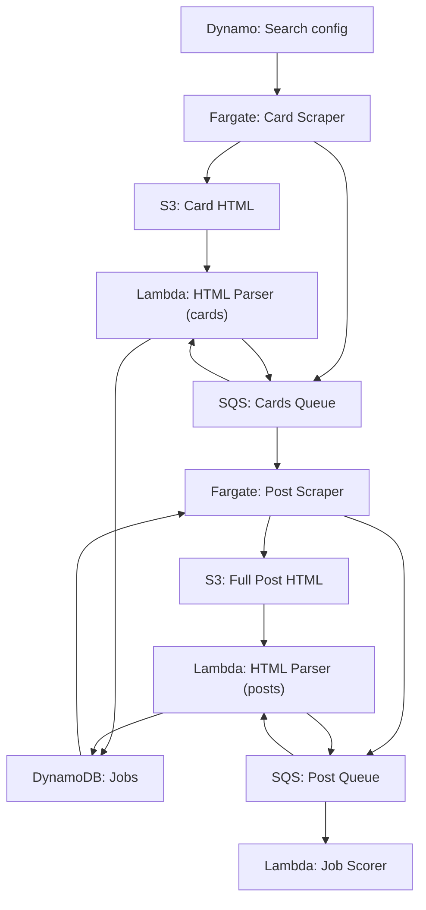
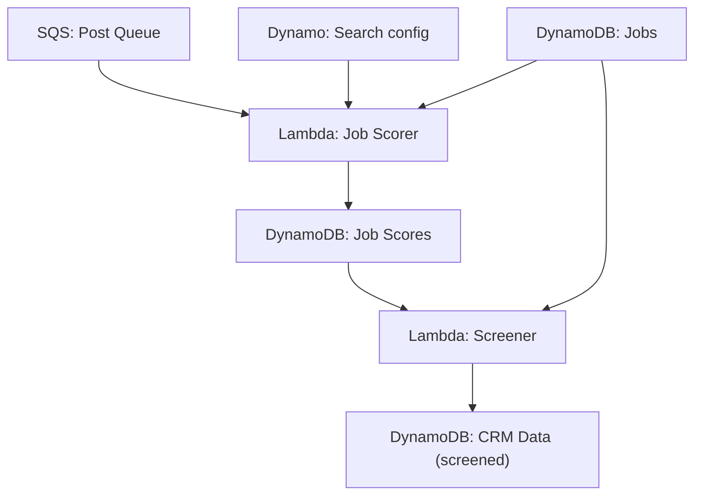
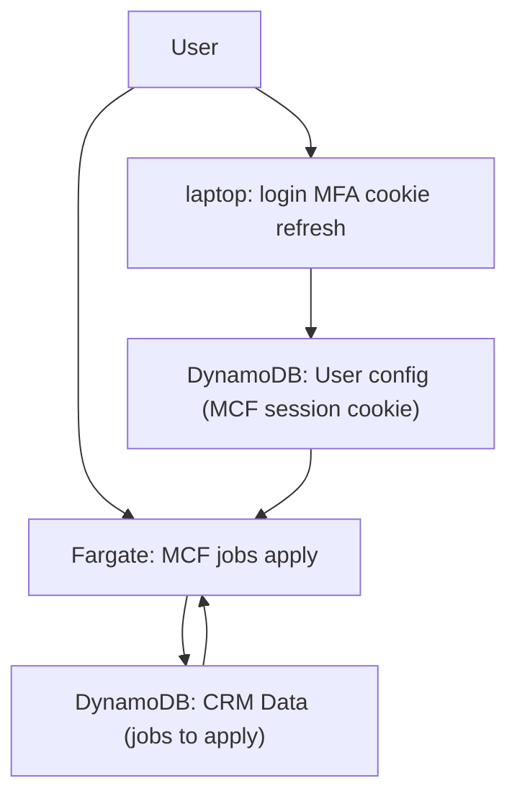
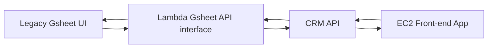
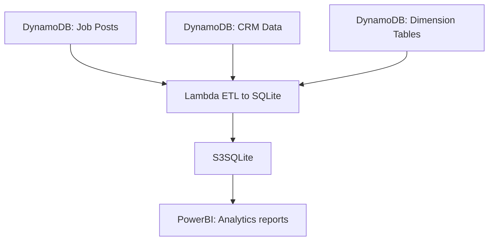

# Workflows

__App workflows__

| id | workflow | description |
| - | - | - |
| 01 | jobs search | scrape data from MCF website parse and store into database |
| 02 | jobs screen | score and screen jobs for curated report jobs to apply |
| 03 | jobs apply | apply jobs through MCF website from shortlisted jobs to apply |
| 04 | CRM API | CRUD operational actions to manage search and move leads through pipeline |
| 05 | analytics ETL | update SQLite DB from data sources DynamoDB tables and refresh PowerBI report |
| 06 | config sync | update config settings |

## Jobs search

## Jobs screen

## Jobs apply

## CRM API

## Analytics ETL

